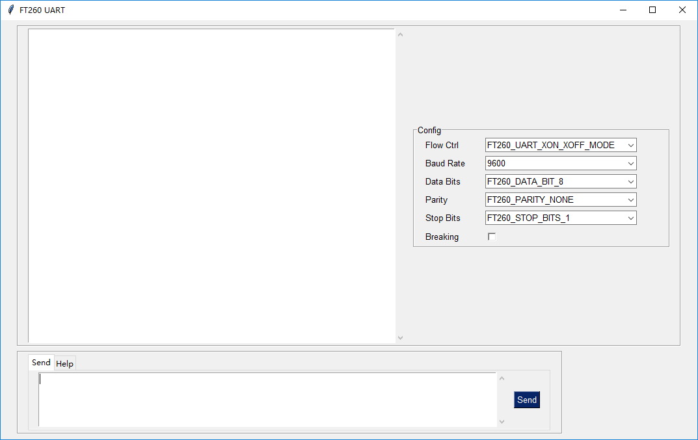
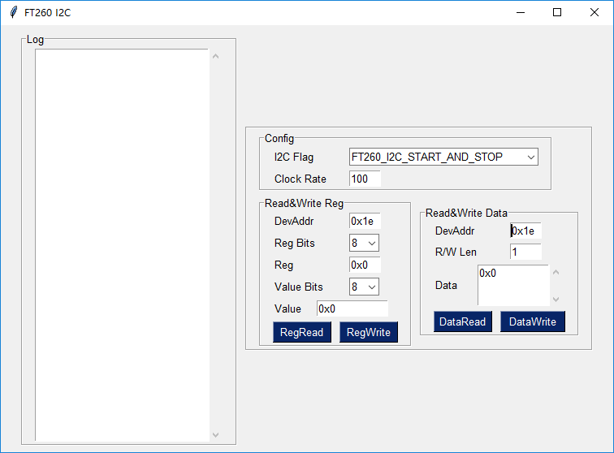

# UART and I2C Python3.7 Gui for [FT260](https://www.ftdichip.com/Products/ICs/FT260.html)

Python32 is required since FTDI provides only 32bit FT260 library binaries
Windows only since FTDI provides only windows library binaries

## Run Gui

* `pip install PySimpleGUI`
* `python ftUartGui.py` to run ftUartGui
  
* `python ftI2cGui.py` to run ftI2cGui
  

## Build Gui EXE file

* `pip install PyInstaller`
* `pyinstaller -wF ftUartGui.py` to Build **dist\ftUartGui.exe**
* `pyinstaller -wF ftI2cGui.py` to Build **dist\ftI2cGui.exe**
* `mkdir dist\lib && copy lib\LibFT260.dll dist\lib\`
* then you can run **ftUartGui.exe** or **ftI2cGui.exe** in dist directory
